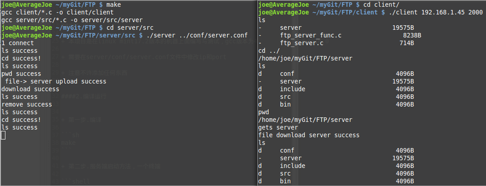

# FTP
FTP Project in C Based on Linux Platform.
=========================================================

##一.概述：


####1.简介

+ 实现过程中利用了socket网络编程中的TCP/IP协议进行客户端和服务器通信

+ 本项目使用的是**进程池**来进行多客户端同时链接

+ 本项目调用了linux的一些接口，同时重写了**recv，read，send，write**等功能

+ 项目中利用了**makefile**功能，方便编译


####2.实现的功能

|实现的命令|对应的功能|
|----------|-----------|
|cd|  进入对应目录|
|ls |列出相应目录文件|
|puts |将本地文件上传至服务器|
|gets| 文件名 |下载服务器文件到本地|
|remove |删除服务器上文件|
|pwd |显示目前所在路径|
|说明|其他命令不响应|


##二.运行方法

####1.说明

+ 本项目是在linux mint17.2版本的机器上面编写与测试，gcc版本为4.8.4，内核版本为3.16.0

+ 需要在server/conf/server.conf文件中修改ip和port

+ 注意不许添加任何东西


####2.编译运行


+ 第一步.编译

```sh
make
```

+ 第二步.服务端启动方法，一个终端

```shell
cd server/src/

./server ../conf/server.conf
```

+ 第三步.客户端，新开另一个终端

```shell
cd client
./client ip port#ip直接输入ipv4的十进制的ip，端口号也是十进制
```

####3.测试


